# Low-Latency Java: A Junior → Senior Curriculum

A self-contained learning repo for **mechanical-sympathy, zero-allocation, ultra-low-latency Java** —
the stack behind exchange matching engines, FX pricing, and HFT risk gateways.

- **This README** = the *theory*: **what** each technology is and **why** it works, chapter by chapter.
- **Each module's README** = the *practice*: **how** to use it, with runnable code and benchmarks.
- **[`GOALS.md`](GOALS.md)** = the north-star plan and the mental model that unifies everything.

> **How to use this repo:** read a chapter here → open the matching module → run its demo →
> run its JMH benchmark → run it under Epsilon GC to *prove* zero allocation. Claim + number + flame graph.

---

## The four enemies (the through-line)

Every technique here defeats one of these. Tag each construct you learn with the enemy it kills.



---

## Chapters

> **The real learning material is the deep-dive concept docs in
> [`docs/chapters/`](docs/chapters/README.md)** — construct internals, diagrams, and worked examples,
> written to be self-contained. The sections below this table are short orientation; the linked deep
> dive for each chapter is where you actually learn it. The **[`docs/topics-map.md`](docs/topics-map.md)**
> indexes every concept to its doc + runnable class.

| # | Chapter | Deep dive (learn) | Module (run) | Core libraries |
|---|---|---|---|---|
| 0 | Foundations | [00-foundations](docs/chapters/00-foundations.md) | [`phase0-foundations`](phase0-foundations) | (pure JDK) |
| 1 | Benchmarking & Profiling | [01-benchmarking](docs/chapters/01-benchmarking.md) | [`phase1-benchmarking`](phase1-benchmarking) | JMH, HdrHistogram, async-profiler |
| 2 | Concurrency & Lock-Free | [02-concurrency](docs/chapters/02-concurrency.md) | [`phase2-concurrency`](phase2-concurrency) | LMAX Disruptor, JCTools |
| 3 | Zero-Allocation & Serialization | [03-zero-alloc](docs/chapters/03-zero-alloc.md) | [`phase3-zero-alloc`](phase3-zero-alloc) | Agrona, Eclipse Collections, SBE |
| 4 | Transport & Persistence | [04-transport-persistence](docs/chapters/04-transport-persistence.md) | [`phase4-transport-persistence`](phase4-transport-persistence) | Aeron, Chronicle, Affinity |
| 5 | JVM & Hardware Sandbox | [05-jvm-hardware](docs/chapters/05-jvm-hardware.md) | [`phase5-jvm-hardware`](phase5-jvm-hardware) | Epsilon/ZGC, `@Contended` |
| 6 | Systems Internals | [06-systems-internals](docs/chapters/06-systems-internals.md) | [`phase6-systems-internals`](phase6-systems-internals) | CPU/GPU, mmap, TCP/UDP, Linux |
| 7 | Native Interop | [07-native-interop](docs/chapters/07-native-interop.md) | [`phase7-native-interop`](phase7-native-interop) | JNI, Unsafe, VarHandle, FFM, JNR-FFI |
| ★ | Capstone: 3 POCs | [capstone README](capstone/README.md) | [`capstone`](capstone) | everything |

Cross-cutting: [`docs/recurring-patterns.md`](docs/recurring-patterns.md) ·
[`docs/topics-map.md`](docs/topics-map.md) · [`docs/cadence.md`](docs/cadence.md)

> Chapters 6–7 cover what the job specs list but ordinary app developers never touch — CPU/GPU
> architecture, shared memory, TCP/UDP internals, Linux tuning, and the JNI/Unsafe/VarHandle/FFM/JNR
> native-interop ladder. The orientation sections below stop at Chapter 5; use the deep-dive links
> above for 6–7.

---

## Chapter 0 — Foundations

**What.** The hardware and JVM facts every later chapter assumes: the CPU cache hierarchy, the
64-byte cache line, the Java Memory Model, and what "allocation" really costs.

**Why it works.** A main-memory fetch is ~100× slower than an L1 hit. If two threads write to two
`long`s that land on the *same* cache line, the cache-coherence protocol (MESI) bounces that line
between cores on every write — **false sharing**. Padding the fields onto separate lines removes the
contention entirely. Nothing else in this repo makes sense until you've *felt* this.



→ **Module proves it:** [`phase0-foundations`](phase0-foundations) benchmarks padded vs unpadded counters.

## Chapter 1 — Benchmarking & Profiling

**What.** The tools that make performance claims *verifiable*: JMH for micro-benchmarks,
async-profiler for flame graphs, JFR/JMC and Eclipse MAT for allocation and leak analysis.

**Why it works.** The JVM lies to naive timing code: JIT dead-code elimination, constant folding,
and warm-up transients make `System.nanoTime()` loops meaningless. JMH forks a clean JVM, warms it
up, and consumes results via `Blackhole` so the optimizer can't delete your work. Async-profiler
samples via `perf_events` rather than at JVM safepoints, so its flame graphs don't suffer
**safepoint bias** (the trap where every naive profiler blames the same few methods).



→ **Module:** [`phase1-benchmarking`](phase1-benchmarking) — autoboxing cost, measured.

## Chapter 2 — Concurrency & Lock-Free

**What.** Passing data between threads without locks or OS context switches: the **LMAX Disruptor**
ring buffer and **JCTools** specialized queues.

**Why it works.** A lock forces threads through the kernel scheduler (µs-scale, unpredictable). The
Disruptor instead uses a pre-allocated ring of reusable event objects and a set of `Sequence`
counters; producers and consumers coordinate by reading each other's padded counters with no locks
and (critically) **no allocation** per event. JCTools queues specialize by cardinality — an
`SpscArrayQueue` (single-producer/single-consumer) needs far less coordination than a general
`MpmcArrayQueue`, so it's dramatically faster. Both lean on the **single-writer principle**: a field
written by exactly one thread never contends.



→ **Module:** [`phase2-concurrency`](phase2-concurrency) — Disruptor demo + MPSC-vs-lock benchmark.

## Chapter 3 — Zero-Allocation & Serialization

**What.** Data structures and wire formats that never allocate on the hot path: **Agrona** primitive
collections + buffers, **Eclipse Collections**, and **SBE** (Simple Binary Encoding).

**Why it works.** `HashMap<Integer,Order>` boxes every `int` key into an `Integer` object and chases
pointers through `Node` objects scattered across the heap — allocation *and* cache misses. Agrona's
`Int2ObjectHashMap` stores primitive `int` keys in a flat open-addressed array: no boxing, no node
objects, cache-friendly probing. SBE takes the same idea to the wire: instead of deserializing bytes
into a new object graph, a **flyweight** decoder wraps the raw buffer and reads fields by fixed byte
offset — zero intermediate objects, decode in nanoseconds.



→ **Module:** [`phase3-zero-alloc`](phase3-zero-alloc) — primitive maps + a hand-rolled order flyweight.

## Chapter 4 — Transport & Persistence

**What.** Getting bytes *between processes/machines* and *onto disk* at microsecond latency:
**Aeron** messaging and the **Chronicle/OpenHFT** family, plus **Java-Thread-Affinity** for pinning.

**Why it works.** Aeron replaces a broker (Kafka) with direct IPC/UDP over a shared-memory log; there
is no serialization to a broker, no page-cache double-copy, no GC. Chronicle Queue persists by
`mmap`-ing a file into the process address space — writing an event is a memory store that the OS
flushes to NVMe lazily, so the *application* thread never blocks on I/O and never touches the JVM
heap. Thread-affinity pins a hot thread to an isolated core so the OS scheduler can't migrate it
(cold caches) or preempt it (jitter).



→ **Module:** [`phase4-transport-persistence`](phase4-transport-persistence) — Aeron IPC + Chronicle journal.

## Chapter 5 — JVM & Hardware Sandbox

**What.** Proving and tuning the runtime: Epsilon GC to *verify* zero allocation, ZGC/Shenandoah for
sub-ms pauses, `@Contended` for padding, and `taskset`/affinity for pinning.

**Why it works.** Epsilon is a no-op collector — it allocates but never reclaims. If your "zero-alloc"
code actually allocates, the heap fills and it dies with `OutOfMemoryError`; survival *is* the proof.
`@Contended` asks the JVM to pad a field onto its own cache line (the same fix as Chapter 0, but
declarative). ZGC/Shenandoah move collection work concurrently with your threads to keep pauses
sub-millisecond. Pinning removes scheduler-induced jitter.


→ **Module:** [`phase5-jvm-hardware`](phase5-jvm-hardware) — `@Contended` demo + GC run scripts.

## Capstone — Three POCs

The interview-grade deliverables that combine every chapter. See [`capstone`](capstone).



| POC | Target number to quote |
|---|---|
| Order Book | 3–5M orders/s single-thread, p99 < 2µs |
| Blended VWAP | cross-thread contention 15µs → ~300ns |
| Risk Gateway | sub-µs durable writes, off the hot path |

---

## Build & run

Requires **JDK 21** and **Maven 3.9+**.

```bash
# Build everything (pure-JVM modules always work; native/mmap modules need their deps resolvable)
mvn -q -T1C install

# Run a module's demo (example)
mvn -q -pl phase2-concurrency exec:java -Dexec.mainClass=com.learning.hft.concurrency.DisruptorDemo

# Build and run a module's JMH benchmarks
mvn -q -Pbench -pl phase0-foundations package
java -jar phase0-foundations/target/benchmarks.jar -prof gc
```

> **Dependency note.** Disruptor, JCTools, Agrona, and Eclipse Collections are pure-JVM and always
> build. Aeron, Chronicle, and Affinity use `Unsafe`/`mmap`/native bits — each module is
> independently buildable so one failing native dependency never blocks the rest of the reactor.

## Repo layout

```
low-latency-java/
├── README.md                 ← you are here (theory / what & why)
├── GOALS.md                  ← north-star plan + mental model
├── pom.xml                   ← parent aggregator (versions, JMH, bench profile)
├── docs/
│   ├── chapters/             ← DEEP-DIVE concept docs (00-07) — the core learning material
│   ├── topics-map.md         ← every concept → its doc + runnable class
│   ├── recurring-patterns.md ← the 3 patterns that recur in every library
│   └── cadence.md            ← trackable checklist
├── scripts/                  ← run-epsilon / run-gc-compare / run-async-profiler
├── phase0-foundations/       ← Chapter 0
├── phase1-benchmarking/      ← Chapter 1
├── phase2-concurrency/       ← Chapter 2
├── phase3-zero-alloc/        ← Chapter 3
├── phase4-transport-persistence/ ← Chapter 4
├── phase5-jvm-hardware/      ← Chapter 5
├── phase6-systems-internals/ ← Chapter 6 (CPU/GPU, memory, TCP/UDP, Linux)
├── phase7-native-interop/    ← Chapter 7 (JNI, Unsafe, VarHandle, FFM, JNR-FFI)
└── capstone/                 ← the 3 POCs (OrderBook implemented)
```

## Sources & further reading

- LMAX Disruptor — [User Guide](https://lmax-exchange.github.io/disruptor/user-guide/index.html), [Baeldung](https://www.baeldung.com/lmax-disruptor-concurrency)
- Aeron / Agrona — [Aeron docs](https://aeron.io/docs/aeron/publications-subscriptions/), [Agents & Idle Strategies](https://aeron.io/docs/agrona/agents-idle-strategies/)
- JCTools — [Getting Started](https://github.com/JCTools/JCTools/wiki/Getting-Started-With-JCTools), [psy-lob-saw lock-free queues](https://psy-lob-saw.blogspot.com/p/lock-free-queues.html)
- Chronicle / OpenHFT — [Chronicle Queue](https://github.com/OpenHFT/Chronicle-Queue), [Baeldung](https://www.baeldung.com/java-chronicle-queue)
- Mechanical sympathy — Martin Thompson's [Mechanical Sympathy blog](https://mechanical-sympathy.blogspot.com/)
