# Chapter 0 — Foundations: Caches, Coherence, and the Java Memory Model

> **Proof module:** [`phase0-foundations`](../../phase0-foundations) ·
> **Enemy:** cache misses & coordination · **Prereq for:** everything.

Nothing else in this curriculum makes sense until these facts are in your bones. This is the
hardware and JVM substrate that every library is bending to its will.

---

## 1. The memory hierarchy and why it dominates latency

A modern CPU core does not "read memory". It reads its **L1 cache**, and only if that misses does it
pay to go further out. The rough numbers (Skylake-class server, 3 GHz) that you should memorize:

| Access | Latency | In CPU cycles | Analogy (if 1 cycle = 1 second) |
|---|---|---|---|
| L1 cache hit | ~1 ns | ~4 | 4 seconds |
| L2 cache hit | ~4 ns | ~12 | 12 seconds |
| L3 cache hit (shared) | ~12–20 ns | ~40 | ~40 seconds |
| Main memory (DRAM) | ~80–100 ns | ~250 | **4 minutes** |
| NVMe SSD read | ~10–100 µs | — | days |
| Network round trip (same DC) | ~50–500 µs | — | weeks |

The single most important consequence: **a main-memory access costs ~250 cycles, during which the
core could have executed hundreds of instructions.** Performance in this domain is not about doing
fewer operations; it is about **not waiting for memory**. Everything — primitive collections,
flyweights, off-heap buffers, data-oriented design — exists to keep the working set in L1/L2.

### Cache lines: memory moves in 64-byte blocks
The cache never fetches one byte or one `long`; it fetches a **64-byte cache line**. This has two
enormous implications:

- **Spatial locality is free.** If you read `array[i]`, then `array[i+1]` is almost certainly already
  in L1 (same line). Sequential array traversal is the fastest access pattern in existence. Pointer
  chasing (linked lists, `HashMap` buckets, object graphs) is the slowest — each hop is a likely
  cache miss.
- **Adjacent unrelated fields share fate.** Two `long`s declared next to each other live on the same
  line. That sets up *false sharing* (below).


---

## 2. Cache coherence (MESI) and false sharing

Each core has its **own** L1/L2. When multiple cores cache the same line, the **MESI protocol** keeps
them consistent. Every cache line in a core is in one of four states:

- **M**odified — this core has the only, dirty copy.
- **E**xclusive — this core has the only, clean copy.
- **S**hared — multiple cores hold clean copies.
- **I**nvalid — stale; must re-fetch.

The rule that bites you: **to write a line, a core must own it Exclusive/Modified, which forces every
other core holding that line to Invalidate their copy.** That invalidation is inter-core traffic
(~40–100+ cycles).

### False sharing
Now suppose thread A on core 0 writes variable `x`, and thread B on core 1 writes variable `y`, and
`x` and `y` happen to sit on the **same cache line**. Even though the threads touch *different
variables*, every write by A invalidates B's line and vice versa. The line **ping-pongs** between
cores, and both threads stall as if they were contending on the same data. They are not sharing data
— they are sharing a *line*. Hence "false" sharing.



**The fix: padding.** Put ≥64 bytes between the two hot variables so they land on different lines.
In [`FalseSharingBenchmark`](../../phase0-foundations/src/main/java/com/learning/hft/foundations/FalseSharingBenchmark.java)
the `Padded` state inserts seven dummy `long`s (56 bytes) between `a` and `b`; adding the object
header and the fields, `a` and `b` end up on separate lines and the ping-pong disappears — typically
a **2–10× throughput win** with zero logic change. This is *the* reason the Disruptor's `Sequence`
and JCTools' queue indices are padded (Ch.2), and why `@Contended` exists (Ch.5).

> **Why 56 and not 64?** Object layout already contributes bytes (mark word / class pointer) and the
> fields themselves are 8 bytes each; you need enough total padding that no two *hot* fields co-reside
> on a line. In practice people over-pad (e.g. 8 longs each side) to survive prefetchers that pull two
> adjacent lines. The benchmark lets you find the knee on your CPU.

---

## 3. Out-of-order execution, and why you need a memory model

A modern core is **superscalar and out-of-order**: it has multiple execution units, executes ~4+
instructions per cycle, predicts branches, and **reorders** independent instructions to hide latency.
The compiler (JIT) *also* reorders. For a single thread this is invisible — the hardware preserves
the illusion of sequential execution ("as-if-serial"). Across threads, the illusion breaks: thread B
can observe thread A's writes **in a different order than A issued them**, because of store buffers,
reordering, and per-core caches.

This is why you cannot reason about concurrent Java with "the code runs top to bottom". You need a
formal contract: the **Java Memory Model (JMM)**.

---

## 4. The Java Memory Model — the rules you actually use

The JMM defines **happens-before**: if action X happens-before action Y, then X's memory effects are
visible to Y. The relations you rely on:

- **Program order** within a thread.
- **Monitor lock**: unlocking a monitor happens-before every subsequent lock of the same monitor.
- **`volatile`**: a write to a volatile field happens-before every subsequent read of that field.
  This is the workhorse of lock-free code.
- **Thread start/join**, and **final field** guarantees (a correctly constructed object's finals are
  visible without synchronization).

### What `volatile` actually compiles to
A `volatile` write is a **store with release semantics** followed (on x86) by a store-load barrier;
a `volatile` read is a **load with acquire semantics**. Concretely:

- **Release (write):** no earlier load/store may be reordered *after* it. So everything you wrote
  before the volatile write is visible to anyone who sees the volatile write.
- **Acquire (read):** no later load/store may be reordered *before* it.

On x86 (strongly ordered) volatile reads are nearly free and volatile writes cost a barrier
(`lock`-prefixed instruction ≈ 20–40 cycles). On ARM/POWER (weakly ordered) both sides emit explicit
fences. **Key point:** `volatile` gives you *visibility and ordering*, not *atomicity of compound
operations* — `x++` on a volatile is still a lost-update race.

### The modern tool: `VarHandle` (and why `Unsafe` is dying)
For years, lock-free libraries used `sun.misc.Unsafe.putOrderedLong` (a.k.a. *lazySet*: a release
store **without** the expensive store-load barrier) for the fast path. The sanctioned replacement is
**`VarHandle`** (JDK 9+), which exposes the full ladder of access modes:

| Access mode | Ordering | Cost | Use |
|---|---|---|---|
| `getPlain`/`setPlain` | none | cheapest | thread-confined data |
| `getOpaque`/`setOpaque` | per-variable progress, no ordering | cheap | counters you only need eventually |
| `getAcquire`/`setRelease` | acquire/release (one-way fence) | moderate | **the lock-free publish idiom** |
| `getVolatile`/`setVolatile` | full volatile | dearest | when you need the store-load barrier |
| `compareAndSet`, `getAndAdd` | atomic RMW | CAS cost | lock-free updates |

`setRelease` + `getAcquire` is exactly what a ring buffer needs to publish a slot: it guarantees the
payload writes are visible before the sequence bump, *without* paying for a full volatile write. This
is the single most important primitive in Chapter 2. (See [Ch.7](07-native-interop.md) for `Unsafe`
vs `VarHandle` vs FFM in depth.)

---

## 5. Data-oriented design: struct-of-arrays

OOP encourages *array-of-structs*: `Order[] orders`, each `Order` an object with `price`, `qty`,
`side`. On the hot path this is a disaster: each `Order` is a separately-allocated heap object, so
iterating the array **pointer-chases** across scattered memory (cache miss per order), and each object
carries 12–16 bytes of header overhead.

*Struct-of-arrays* flips it: `long[] price, long[] qty, byte[] side`, all parallel, indexed by the
same order index. Now iterating prices is a linear scan of one contiguous array — maximal spatial
locality, zero per-element headers, and the JIT can even vectorize it. This is exactly how the
capstone [`OrderBook`](../../capstone/src/main/java/com/learning/hft/capstone/orderbook/OrderBook.java)
stores its order pool, and why matching engines don't use `TreeMap<Price, LinkedList<Order>>`.

---

## 6. Allocation and the TLAB (a teaser for Ch.5)

`new` in Java is cheap *to execute* (bump a pointer in a thread-local allocation buffer, the **TLAB**)
but expensive *in aggregate*: every allocated byte must eventually be traced and reclaimed by the GC,
and high allocation rate = frequent GC = latency spikes. Hence the domain mantra: **zero allocation
on the hot path.** You allocate everything up front (pools, ring buffers, flyweights) and reuse it.
Ch.5 shows how to *prove* you achieved this with the Epsilon GC.

---

## 7. Worked example — run it yourself

```bash
mvn -Pbench -pl phase0-foundations package
java -jar phase0-foundations/target/benchmarks.jar FalseSharing
```
Compare `padded` vs `unpadded` throughput. Then, for the coherence story at the assembly level, run
under `-prof perfasm` (Linux) and find the `lock`-prefixed instruction on the volatile write.

---

## Senior interview answers

- **"What is false sharing and how do you fix it?"** Two independent hot variables on the same
  64-byte cache line cause MESI invalidation ping-pong across cores; pad them onto separate lines
  (manually, or with `@Contended`).
- **"What does `volatile` guarantee?"** Visibility and ordering via a happens-before edge
  (release on write, acquire on read); it does **not** make `x++` atomic.
- **"Why is a linked list slow and an array fast even for the same O(n)?"** The array is contiguous
  (spatial locality, one cache line brings ~8 longs); the list pointer-chases, ~1 cache miss per node
  — a 10–100× constant factor.
- **"Why struct-of-arrays?"** Contiguous per-field scans maximize cache-line utilization and enable
  vectorization; array-of-structs pays a header and a cache miss per element.
