# Chapter 1 — Benchmarking & Profiling: Measuring Without Lying to Yourself

> **Proof module:** [`phase1-benchmarking`](../../phase1-benchmarking) ·
> **Skill:** every performance claim you make must be reproducible.

The defining failure of junior performance work is **measuring the JVM instead of the code**. This
chapter is about the traps and the tools that avoid them.

---

## 1. Why naive timing is worthless on the JVM

Consider the "obvious" benchmark:
```java
long t0 = System.nanoTime();
for (int i = 0; i < N; i++) result = compute(i);
long t1 = System.nanoTime();   // (t1-t0)/N — WRONG
```
Every one of these will corrupt your number:

- **JIT warm-up.** The first thousands of calls run interpreted or C1-compiled; C2 kicks in later.
  You'll measure a blend of tiers.
- **Dead-code elimination (DCE).** If `result` is never used, C2 proves `compute(i)` has no effect
  and **deletes the entire loop**. You measure an empty loop → "0.3 ns", and conclude your code is
  infinitely fast.
- **Constant folding.** If `compute` is called with a constant, C2 computes it once at compile time.
- **Loop unrolling / hoisting.** Invariant work is hoisted out; the loop is unrolled, changing the
  per-op cost.
- **On-Stack Replacement (OSR).** A long-running loop gets compiled *mid-execution* with a different
  code shape than a normal method call would.
- **GC and safepoints.** A GC pause or a safepoint in your window skews the mean and destroys tail
  percentiles.

---

## 2. JMH — how it defends against each trap

**JMH (Java Microbenchmark Harness)** is the OpenJDK tool that does the ceremony correctly.



Mechanisms, mapped to the traps:

- **`@Fork`** runs each benchmark in a **fresh JVM** so one benchmark's JIT profile can't pollute
  another's (profile-guided optimization is per-process). Multiple forks also expose run-to-run
  variance from JIT/GC nondeterminism.
- **`@Warmup`** runs the code until C2 reaches steady state before any measurement.
- **`Blackhole`** — you pass results to `bh.consume(x)`; the Blackhole is written so C2 *cannot* prove
  the value is unused, defeating DCE. (Alternatively, *return* the value from the method — JMH
  consumes returns via an implicit Blackhole.)
- **`@State`** holds fixtures across invocations; combined with inputs the JIT can't treat as
  constants, it defeats constant folding.
- **`@Setup`/`@TearDown`** with `Level.Trial/Iteration/Invocation` keep setup cost out of the timed
  region.
- **`Mode`**: `Throughput` (ops/time), `AverageTime` (time/op), and — critically for us —
  **`SampleTime`**, which records a *distribution* so you get **p99/p999/max**, not just a mean.
- **Profilers via `-prof`**: `gc` (allocation rate — the zero-alloc lie detector), `perfasm`
  (annotated assembly — see the actual `lock` prefixes and cache-miss stalls), `perfnorm`
  (hardware counters: IPC, cache misses per op).

See [`BoxingBenchmark`](../../phase1-benchmarking/src/main/java/com/learning/hft/benchmarking/BoxingBenchmark.java):
run it with `-prof gc` and read `gc.alloc.rate.norm` (bytes/op). The `HashMap<Integer,Integer>` path
allocates on autoboxing; the Agrona primitive map reports ~0 B/op. **The allocation number is the
point**, not just the time.

---

## 3. Coordinated omission — the tail-latency lie (and HdrHistogram)

This is the most important measurement concept in low-latency work, and the one most people get
wrong. Coined by Gil Tene.

**The setup.** You measure latency by sending a request, timing the response, and looping. You intend
to sample at a fixed rate (say one request every 1 ms). Suppose the system stalls for 100 ms (a GC
pause, say). During that stall you send **zero** requests — the loop is blocked *inside* the one slow
request. When it finally returns, you record **one** 100 ms sample and resume.

**The lie.** In reality, ~100 requests that *should* have been sent during the stall were "omitted".
Each of them would have measured a large (decreasing) latency: 100 ms, 99 ms, 98 ms, … Your histogram
recorded a single bad sample instead of a hundred. Your p99 looks fantastic; your users experienced a
catastrophe. The measurement **coordinated with the system under test** to hide exactly the events you
care about.



**The fixes:**
1. **Measure against a schedule, not a loop.** Each request has an *intended* start time; latency =
   (completion time − intended start time). A request delayed behind a stall correctly shows a large
   latency.
2. **HdrHistogram with expected-interval correction.** `Recorder`/`Histogram.recordValueWithExpectedInterval(value, expectedInterval)`
   *synthesizes* the omitted samples for you: if you record 100 ms with a 1 ms expected interval, it
   back-fills 100 ms, 99 ms, … so the percentiles reflect reality.

**Why HdrHistogram at all?** It records values across a huge dynamic range (nanoseconds to hours) at
**constant, configurable precision** using a bucketed layout, with **zero allocation** on the record
path and lossless percentile queries. A naive `long[]` of samples either loses resolution or blows up
memory; `HdrHistogram` is the standard. See
[`LatencyHistogramDemo`](../../phase1-benchmarking/src/main/java/com/learning/hft/benchmarking/LatencyHistogramDemo.java)
for correct vs coordinated-omission-afflicted percentiles side by side.

---

## 4. Async-profiler — flame graphs without safepoint bias

Traditional Java sampling profilers call `Thread.getStackTrace()`, which only runs at a **safepoint**
(a JVM checkpoint where a thread can be stopped). But the JIT elides safepoint polls from tight,
inlined, counted loops — precisely the hot code. So the profiler can only sample your thread *between*
hot regions, and it systematically **mis-attributes** time. This is **safepoint bias**, and it makes
naive profilers blame the wrong methods.

**async-profiler** instead uses OS `perf_events` / `SIGPROF` to interrupt the thread at *any*
instruction and walk the stack via `AsyncGetCallTrace`. No safepoint required → no bias. Modes you'll
use:
- `-e cpu` — where CPU cycles go (the classic flame graph).
- `-e alloc` — **allocation** flame graph: which call sites allocate, and how much. Your zero-alloc
  audit tool at method granularity (complements JMH's aggregate `-prof gc`).
- `-e wall` — wall-clock including blocked/parked time (find where you're waiting, not spinning).
- `-e cache-misses` / `-e L1-dcache-load-misses` — hardware counters, to confirm a cache-miss
  hypothesis from Ch.0.

Reading a flame graph: **width = time (or bytes)**, y-axis = stack depth. The widest boxes at the top
are your hot leaves. See [`../../scripts/run-async-profiler.sh`](../../scripts/run-async-profiler.sh).

---

## 5. JFR, JMC, and heap analysis (MAT)

- **JFR (Java Flight Recorder)** — always-on, ~1% overhead event recorder built into the JVM
  (`-XX:StartFlightRecording`). Records GC pauses, allocation profiles, safepoint durations, lock
  contention, and more into a `.jfr` file.
- **JMC (JDK Mission Control)** — opens `.jfr` files; use it to see GC pause distribution, allocation
  by class/thread, and the "Latency" pages.
- **Eclipse MAT** — offline heap-dump analysis. The **dominator tree** shows which objects keep the
  most memory alive (your leak suspects); "path to GC roots" tells you *why* an object survives.

**When to use which:** JMH for a specific method's cost; async-profiler for "where is my whole app
spending time/allocations right now"; JFR for a production-safe always-on recording; MAT for "why is
my heap full / what leaked".

---

## Senior interview answers

- **"How do you benchmark a Java method correctly?"** JMH: forked JVM, warm-up to C2 steady state,
  Blackhole to defeat DCE, `@State` to defeat constant folding, `SampleTime` for percentiles, and
  `-prof gc` to catch hidden allocation.
- **"What is coordinated omission?"** A measurement loop that stops sending requests while the system
  is stalled, recording one bad sample instead of the many delayed ones — hiding the tail. Fix by
  measuring against an intended schedule and/or `recordValueWithExpectedInterval`.
- **"Why not just use a sampling profiler?"** Safepoint bias mis-attributes hot inlined loops;
  async-profiler samples via perf_events at any instruction, so its flame graphs are trustworthy.
- **"How do you prove zero allocation?"** JMH `-prof gc` = 0 B/op, an async-profiler `alloc` flame
  graph with no hot-path frames, and an Epsilon-GC run that survives (Ch.5).
