# Chapter 2 — Concurrency & Lock-Free: Disruptor and JCTools Internals

> **Proof module:** [`phase2-concurrency`](../../phase2-concurrency) ·
> **Enemy:** coordination (locks, context switches, contention).

The goal: pass data between threads with **no locks, no allocation, and no kernel involvement**. To
get there you need to understand *why* locks are slow and *how* lock-free structures achieve
correctness without them.

---

## 1. Why locks are expensive at this scale

A `synchronized`/`ReentrantLock` under contention does not just "wait". The losing thread is **parked**
by the OS scheduler: its context is saved, the core is handed to another thread, and later it's
rescheduled and its caches are cold. That round trip is **1–10 µs** — an eternity when your budget is
hundreds of nanoseconds. Even *uncontended* locks cost a CAS and inhibit some JIT optimizations.
Worse, locks cause **priority inversion**, **convoying**, and unbounded tail latency (you can't put a
p99 bound on "when will the scheduler run me again").

Lock-free algorithms avoid parking entirely: threads coordinate through **atomic reads/writes of
shared counters** and make progress by spinning or retrying, never surrendering the core.

## 2. The single-writer principle

The cheapest concurrent variable is one with **exactly one writer**. A field written by only one
thread never needs a CAS and never causes write-write contention; other threads only *read* it. Nearly
every structure in this chapter is built to preserve single-writer discipline: the ring buffer's
producer sequence has one writer, each consumer's sequence has one writer, and so on. When you see a
design "fan in many producers to one consumer" (MPSC), it's to make the *consumer* side single-writer.

---

## 3. LMAX Disruptor internals

### The structure
A **RingBuffer** is a power-of-two-sized array of **pre-allocated, reusable event objects** plus a set
of monotonically increasing **sequence** counters. "Publishing" never allocates: you claim the next
slot index, mutate the event object already living there, and advance a sequence.

### Sequences, cursor, and gating
- Each **`Sequence`** is a single `long` **padded on both sides** (`Sequence extends
  LhsPadding/Value/RhsPadding`) so it occupies its own cache line — no false sharing with neighbours
  (Ch.0). It's updated with **release semantics** (`setRelease`/`putOrderedLong`), not a full volatile
  write, on the hot path.
- The **cursor** is the producer's published sequence. A consumer's `SequenceBarrier` **waits** until
  `cursor >= consumer.sequence + 1`, i.e. "is my next slot published yet?".
- **Gating sequences** prevent the producer from lapping the ring: before claiming slot N, the
  producer checks that the slowest consumer has passed slot `N - bufferSize`. This is how a bounded
  ring provides back-pressure with no locks.

### Index → slot: the power-of-two trick
`slotIndex = sequence & (bufferSize - 1)`. Because size is a power of two, the modulo becomes a single
bitmask — no division. This trick recurs in **every** ring buffer and array queue in the ecosystem.

### Single vs multi-producer claim
- **Single-producer** (`ProducerType.SINGLE`): the producer owns the "next" counter outright — no CAS.
  Fastest.
- **Multi-producer** (`MULTI`): producers `compareAndSet` to claim sequences, then must signal
  *per-slot* availability (an `availableBuffer` int array) because slots can be published out of order.
  Consumers read the availability flags to know a slot is truly ready.

### Batching — the latency-under-load superpower
When a consumer wakes and the cursor has advanced by 10, it processes **all 10** in one go
(`endOfBatch` marks the last). Under load, batch size grows automatically, so **per-item cost falls
exactly when you're busiest** (amortized barrier checks, warm I-cache). This is why the Disruptor's
throughput *improves* under bursty load instead of collapsing like a lock-based queue.

### WaitStrategy — the CPU/latency dial
How a consumer waits for the cursor to advance:

| Strategy | Mechanism | Latency | CPU | When |
|---|---|---|---|---|
| `BusySpinWaitStrategy` | spin on the volatile read | lowest | 100% of a core | dedicated isolated core |
| `YieldingWaitStrategy` | spin, then `Thread.yield()` | very low | high | low core contention |
| `SleepingWaitStrategy` | spin, yield, then `park(1ns)` | low-ish | modest | balanced |
| `BlockingWaitStrategy` | lock + condition | highest | lowest | throughput / shared boxes |

This exact dial reappears as Agrona/Aeron `IdleStrategy` (Ch.4) — see
[`recurring-patterns.md`](../recurring-patterns.md).

### Topologies
Consumers form a **dependency graph**: broadcast (every `EventHandler` sees every event), pipelines
(`handleEventsWith(a).then(b)`), and **diamonds** (parallel handlers join before a downstream one via
a shared `SequenceBarrier`). This lets you build, e.g., journal-and-replicate-in-parallel-then-match
with no locks. See [`DisruptorDemo`](../../phase2-concurrency/src/main/java/com/learning/hft/concurrency/DisruptorDemo.java).

---

## 4. JCTools internals

Where the Disruptor is a *framework* (it owns your threads and event lifecycle), **JCTools** gives you
raw, drop-in `java.util.Queue` implementations specialized by **cardinality**.

### Cardinality = speed
| Queue | Producers/Consumers | Coordination cost |
|---|---|---|
| `SpscArrayQueue` | 1 / 1 | none — plain stores + release/acquire on indices |
| `MpscArrayQueue` | many / 1 | producers CAS the tail; consumer is single-writer |
| `SpmcArrayQueue` | 1 / many | consumers CAS the head |
| `MpmcArrayQueue` | many / many | CAS on both ends — most expensive |

**Pick the weakest guarantee that fits.** An SPSC queue between two known threads is dramatically
cheaper than MPMC, because it needs no CAS at all — just release/acquire on the producer and consumer
index (the Lamport algorithm, refined by "Fast-Flow").

### How SPSC works (the core idea)
Producer and consumer each own an index. The producer writes the element **then** `setRelease`s its
index; the consumer `getAcquire`s the producer index, and if it's ahead, reads the element (the
release/acquire pair guarantees the element write is visible before the index bump — Ch.0). No CAS
because each index has a single writer.

### The padding layout (why it's fast)
Open the source of `MpscArrayQueue` and you'll see a **tower of classes**:
`...L1Pad → ConsumerField → L2Pad → ProducerFields → L3Pad...`. This inheritance trick forces the JVM
to lay the fields out with **cache-line padding between the producer index and the consumer index**,
so the two hot, independently-written counters never share a line (active false sharing) — and the
padding also isolates them from the read-only capacity/mask fields (passive false sharing). The array
**references** at the ends are padded too. This is Ch.0's lesson, industrialized.

### MPSC producer algorithm
Producers `getAndAdd`/`compareAndSet` to claim a unique tail index (an extension of Lamport's queue),
write their element into that slot, and publish it; the single consumer polls with the "Fast-Flow"
method (read the slot; if non-null, it's ready — no separate index read needed). Because the consumer
is single-writer on the head, its side is CAS-free.

### Capacity, `null`, and relaxed ops
Array queues are **bounded** (back-pressure via a full `offer()` returning false — you must handle it,
exactly like Aeron's `BACK_PRESSURED`). Elements can't be `null` (null is the empty sentinel). The
`relaxedOffer`/`relaxedPoll` variants drop the "never falsely report full/empty" guarantee for a bit
more speed when you're going to retry anyway. See
[`QueueHandoffBenchmark`](../../phase2-concurrency/src/main/java/com/learning/hft/concurrency/QueueHandoffBenchmark.java).

---

## 5. Disruptor vs JCTools — when to reach for which

- **Disruptor** when you want a full pipeline: pre-allocated events, dependency topologies, batching,
  replay-friendly sequencing (it's the backbone of an exchange's inbound sequencer).
- **JCTools** when you just need a fast queue between specific threads (e.g. many market-data feed
  threads → one pricing engine = `MpscArrayQueue`, the POC-2 pattern). Lighter weight, you own the
  threads.

---

## Senior interview answers

- **"Why is the Disruptor faster than `ArrayBlockingQueue`?"** No locks (sequences + release/acquire),
  no per-event allocation (pre-allocated ring), mechanical-sympathy padding, and **batching** that
  lowers per-item cost under load. ABQ takes a lock per op and parks under contention.
- **"How does a bounded lock-free queue apply back-pressure?"** Gating sequences (Disruptor) or a full
  `offer()` returning false (JCTools) — the producer must not lap the slowest consumer.
- **"Why does JCTools have four array queues?"** Cardinality determines the minimum coordination:
  SPSC needs no CAS; MPMC needs CAS on both ends. Use the weakest that fits.
- **"What is `setRelease`/lazySet and why use it over volatile?"** A release store without the full
  store-load barrier — it publishes prior writes cheaply, sufficient for the single-writer sequence
  bump on the hot path.
