# Chapter 7 — Native Interop: JNI, Unsafe, VarHandle, FFM, JNR-FFI

> **Proof module:** [`phase7-native-interop`](../../phase7-native-interop) ·
> **Why:** the JD asks for "GC, JNI, Java Unsafe, JNR-FFI" — the mechanisms by which Java touches
> off-heap memory and native code. These are exactly what business-app developers never use.

There are two distinct needs here, often conflated: (a) **off-heap memory access** (read/write raw
memory, e.g. an mmap'd buffer or a NIC ring) and (b) **calling native code** (a C library, a syscall).
Five tools cover them, on a clear historical arc from `Unsafe` → FFM.

---

## 1. `sun.misc.Unsafe` — the old foundation (and why it's dying)

`Unsafe` is an internal JDK class that exposes raw memory and JVM intrinsics. For ~15 years it was the
**secret engine** under Netty, Agrona, the Disruptor, Cassandra, and virtually every high-performance
Java library. What it gives:
- **Off-heap allocation**: `allocateMemory(bytes)` / `freeMemory(addr)` — malloc/free, GC-invisible.
- **Raw access**: `getLong(addr)` / `putLong(addr, v)` at an absolute address; `getLong(object,
  offset)` for **field access by offset** (the basis of lock-free field updates).
- **Ordering intrinsics**: `putOrderedLong` (lazySet — release store without the full barrier),
  `compareAndSwapLong` (CAS), `loadFence`/`storeFence`/`fullFence`.
- **Object tricks**: `objectFieldOffset`, `allocateInstance` (construct without a constructor).

**Why it's going away:** it's unsafe by name and nature — a bad address is a **JVM crash (SIGSEGV)**,
not an exception — and it bypasses the module system. It's deprecated for removal (JEP 471 deprecated
the memory-access methods; JEP 498 warns at runtime). Its two jobs are being split cleanly: **VarHandle**
for on-heap ordered/atomic field access, and **FFM (`MemorySegment`)** for off-heap memory. See
[`UnsafeDemo`](../../phase7-native-interop/src/main/java/com/learning/hft/nativeinterop/UnsafeDemo.java)
(obtained via reflection, since the field is private) — study it to *read* legacy library code, not to
write new code.

---

## 2. `VarHandle` — the sanctioned on-heap successor

A `VarHandle` is a typed reference to a variable (field, array element, buffer slot) that exposes the
full ladder of **access modes** — the same ones from Ch.0:

| Mode | Ordering | Replaces |
|---|---|---|
| `get`/`set` (plain) | none | plain field access |
| `getOpaque`/`setOpaque` | per-variable, no cross-variable ordering | — |
| `getAcquire`/`setRelease` | one-way acquire/release fence | `Unsafe.putOrderedX` (lazySet) |
| `getVolatile`/`setVolatile` | full volatile (store-load barrier) | `volatile` field |
| `compareAndSet`, `getAndAdd`, `getAndSet` | atomic read-modify-write | `Unsafe` CAS |

`setRelease` + `getAcquire` is **the lock-free publish idiom** — publish a payload then release-store a
ready flag/sequence; the reader acquire-loads the flag and is guaranteed to see the payload (Ch.2's
ring buffers). Obtain one with `MethodHandles.lookup().findVarHandle(...)` or
`MethodHandles.arrayElementVarHandle(long[].class)`. See
[`VarHandleDemo`](../../phase7-native-interop/src/main/java/com/learning/hft/nativeinterop/VarHandleDemo.java).
**Use VarHandle, not `AtomicLong`/`Unsafe`, for new lock-free field access** — it's safe, typed, and
JIT-intrinsified to the same instructions.

---

## 3. FFM / Project Panama — the modern off-heap + native API

The **Foreign Function & Memory API** (`java.lang.foreign`) is the sanctioned replacement for *both*
off-heap `Unsafe` **and** JNI. (Finalized in JDK 22; **preview in JDK 21** — this module compiles with
`--enable-preview`.) Two halves:

### Foreign Memory — safe off-heap
- **`Arena`** — a scope that owns native memory and deterministically frees it (`try (Arena a =
  Arena.ofConfined())`). No `freeMemory` leaks, no use-after-free (the arena enforces temporal
  bounds), and **spatial** bounds are checked — a bad offset is an exception, not a SIGSEGV.
- **`MemorySegment`** — a bounded view of memory (off-heap, on-heap, or mmap'd). Read/write via typed
  `ValueLayout` (`segment.get(JAVA_LONG, offset)`), or map a file with
  `FileChannel.map(..., arena)` to get an mmap'd segment (safe Ch.4/Ch.6 mmap).

### Foreign Function — calling C without JNI
- **`Linker.nativeLinker()`** + **`SymbolLookup`** find a native function; **`downcallHandle`** with a
  **`FunctionDescriptor`** yields a `MethodHandle` you invoke like Java. Example (calling libc
  `strlen`):
  ```java
  Linker linker = Linker.nativeLinker();
  MethodHandle strlen = linker.downcallHandle(
      linker.defaultLookup().find("strlen").orElseThrow(),
      FunctionDescriptor.of(JAVA_LONG, ADDRESS));
  try (Arena a = Arena.ofConfined()) {
      MemorySegment cStr = a.allocateUtf8String("hello");
      long len = (long) strlen.invoke(cStr);   // 5
  }
  ```
- **Upcalls** let C call back into Java (a `MethodHandle` as a function pointer).

See [`ForeignMemoryDemo`](../../phase7-native-interop/src/main/java/com/learning/hft/nativeinterop/ForeignMemoryDemo.java).
FFM is the future: safe, no C glue code, and the JIT can optimize across the boundary far better than
JNI can.

---

## 4. JNI — the classic native bridge (and its costs)

**JNI (Java Native Interface)** is the original way to call C/C++ from Java. You declare a `native`
method, generate a header, implement it in C against the `JNIEnv` API, compile a shared library, and
`System.loadLibrary` it.

Why it's avoided on the hot path:
- **Boundary cost**: each call is a **state transition** (managed ↔ native). The JIT **cannot inline
  across it**, and it may involve setting up the `JNIEnv`, handling exceptions, and pinning.
- **GC interaction**: while native code holds a `GetPrimitiveArrayCritical` region, the GC may be
  **blocked** (can't move objects) — a native call that dawdles can stall collection. Passing Java
  objects means marshalling or pinning.
- **Fragility & build complexity**: a crash in C is a JVM crash; you need a per-platform toolchain.

A JNI example inherently needs a C compiler, so this repo ships the **complete** Java + C + build
commands as reference (see the module's `native/` folder and README) rather than building it in the
Maven reactor. Study it to understand the mechanism and *why FFM/JNR now beat it*.

---

## 5. JNR-FFI — call C without writing C

**JNR-FFI** (Java Native Runtime) lets you bind a native library by declaring a **Java interface** —
no C glue, no header generation. It generates the trampolines at runtime (via libffi/ASM):
```java
public interface LibC { int getpid(); long strlen(String s); }
LibC libc = LibraryLoader.create(LibC.class).load(Platform.getNativePlatform().getStandardCLibrary());
```
It's the pragmatic pre-Panama choice for "I just need to call a few C functions" and still widely used
(e.g. by jRuby, and libraries needing POSIX calls). See
[`JnrExample`](../../phase7-native-interop/src/main/java/com/learning/hft/nativeinterop/JnrExample.java),
which calls libc `getpid`/`strlen` and runs cross-platform (libc on Linux/macOS, msvcrt on Windows).

---

## 6. Decision guide — which tool when



| Tool | Job | Safety | Status |
|---|---|---|---|
| `Unsafe` | off-heap + field access | crashes on error | **deprecated for removal** |
| `VarHandle` | on-heap ordered/atomic access | safe, typed | **current** |
| FFM memory | off-heap + mmap | bounds+lifetime checked | JDK22+ (preview 21) |
| FFM function | call C | safe, no glue | JDK22+ (preview 21) |
| JNI | call C (legacy) | crashes on error | legacy |
| JNR-FFI | call C without C glue | safe-ish | mature 3rd-party |

---

## Senior interview answers

- **"What replaces `Unsafe`?"** Split in two: `VarHandle` for on-heap ordered/atomic field access, and
  the FFM API (`MemorySegment`/`Arena`) for off-heap memory — both safe and bounds/lifetime-checked.
- **"Why is JNI slow / risky on the hot path?"** Managed↔native state transitions the JIT can't inline
  across, possible GC blocking during critical regions, marshalling, and crash-on-error fragility.
- **"When JNR-FFI vs FFM vs JNI?"** FFM if on JDK 22+ (safe, no glue); JNR-FFI for a quick,
  glue-free binding pre-Panama; JNI only for legacy code or when you truly need the `JNIEnv` API.
- **"What's `setRelease`/`getAcquire` for?"** The cheap lock-free publish/consume idiom — publish a
  payload, release-store a flag; the consumer acquire-loads the flag and is guaranteed to see the
  payload — without a full volatile barrier.
