# Chapter 8 — Fast Decisioning: Rules, Bitsets, DAG/Dataflow, CEP

> **Proof module:** [`phase8-decisioning`](../../phase8-decisioning) · **Capstone:** POC 4
> ([`PreTradeRuleGateway`](../../capstone/src/main/java/com/learning/hft/capstone/rulegateway/PreTradeRuleGateway.java)) ·
> **Enemy:** wasted work + coordination in the *decision* layer.

Chapters 0–7 make data *move, persist, and get measured* fast. This chapter makes the system *decide*
fast — the other half of a trading platform. Two shapes recur:

1. **Per-request rule evaluation** — a pre-trade gateway runs hundreds–thousands of checks on *every*
   order (fat-finger, notional caps, restricted symbols, self-trade, entitlements, a kill switch)
   inside a ~100µs budget, and operators must **enable/disable rules live** with no restart.
2. **Reactive recompute over streaming inputs** — derived values (a quote **skew**) update as prices
   stream, and some **activate at a scheduled start time**.

The senior skill is knowing which tool fits which shape, and why the obvious tool (a general rules
engine) is usually wrong for the hot path.

---

## 1. The strategy landscape (and the hot-path verdict)

| Approach | Mechanism | Latency profile | Where it belongs |
|---|---|---|---|
| **RETE** (Drools) | incremental pattern-match network over facts | allocates, reflects; ms-ish | complex, analyst-managed business/compliance rules **off** the hot path |
| **CEP** (Esper) | SQL-like EPL over event windows; Esper 8+ compiles to bytecode | sub-µs per event, but streaming-oriented | surveillance, alerting, deriving **signals** from a stream |
| **Decision tables** | condition/action lookup table | fast lookup | tabular, business-owned rulesets |
| **Compiled predicates + bitset** | hand-rolled branchless checks, bit-masked applicability | **tens of ns**, zero-alloc | the **order hot path** |

**Verdict:** on the nanosecond matching/gateway path you hand-roll compiled predicates and drive
applicability/enablement with **bitsets**. Drools and Esper are excellent *complements* for the
risk/compliance and surveillance tiers, where rulesets are large, change often, and live off the
critical path. Saying that trade-off out loud is the interview signal; "I'd run Drools on the matching
path" is the anti-signal.

---

## 2. Bitset rule evaluation — thousands of rules + a one-AND kill switch

Represent rules as indices `0..N-1`. Keep two bitsets (`long[]`, one bit per rule):
- **`enabled`** — bit *i* set ⇒ rule *i* is active. Enable/disable is a **single bit op**, live, with
  no restart or recompile.
- **`applicable`** (per order/instrument) — bit *i* set ⇒ rule *i* applies here. Precompute one mask
  per instrument.

Evaluate by iterating only the `enabled & applicable` bits with two classic tricks:
`Long.numberOfTrailingZeros(bits)` to find the next set bit, and `bits &= bits - 1` to clear the
lowest set bit. Disabled or inapplicable rules cost **nothing**, and there is **zero allocation**.

This is the hot-path engine in
[`BitsetRuleEngine`](../../phase8-decisioning/src/main/java/com/learning/hft/decisioning/bitset/BitsetRuleEngine.java);
a global **kill switch** is just one rule whose predicate returns `!engaged`. Note the honest caveat
(Ch.5): calling thousands of *distinct lambda* rules through one interface site is **megamorphic** —
so production compiles rules to a monomorphic/branchless form (codegen or a switch/jump table); the
bitset's value is the O(1) applicability + instant enable/disable, not the dispatch.

Run [`BitsetRuleEngineDemo`](../../phase8-decisioning/src/main/java/com/learning/hft/decisioning/bitset/BitsetRuleEngineDemo.java)
to watch a rule toggle flip a verdict live; benchmark with `-prof gc` to confirm 0 B/op and that
throughput scales with the number of *enabled* rules, not the total.

---

## 3. Membership: `long[]`/`BitSet` vs RoaringBitmap

Many rules are set-membership: "is this symbol restricted?", "is this account entitled?".
- **Dense, small, hot-path flags** → a plain `long[]` / `java.util.BitSet`: one AND/test, cache-line
  friendly (Ch.0).
- **Large, sparse sets** (a restricted list of a few thousand symbols across millions of ids) →
  **RoaringBitmap**, "the compressed bitset at the core of matching engines". It chunks the id space
  and picks array/bitmap/run encoding per chunk, so it stays tiny *and* fast.

[`SymbolSetDemo`](../../phase8-decisioning/src/main/java/com/learning/hft/decisioning/membership/SymbolSetDemo.java)
shows the gap: 2,000 ids over a 5M universe cost a `BitSet` ~625 KB but a RoaringBitmap ~4.6 KB, with
O(1) `contains` either way.

---

## 4. DAG / dataflow — reactive skew and "activate from a start time"

For the streaming shape, model derived values as a **DAG**: inputs (bid, ask, "skew active") feed
derived nodes (mid → skew → quotes). Precompute a **topological order** once; when an input changes,
mark it dirty and recompute **only the nodes reachable from it, in order** — *dirty propagation* /
incremental computation. Unrelated branches don't recompute. The hot path walks a flat `int[]` order
and touches only dirty nodes — zero allocation.

[`DataflowGraph`](../../phase8-decisioning/src/main/java/com/learning/hft/decisioning/dataflow/DataflowGraph.java)
implements this (Kahn topo-sort at build, dirty propagation in `recompute()`, a recompute counter to
*prove* incrementality — see `DataflowGraphTest`). The **"skew starts at time T"** requirement is a
scheduled input flip: an Agrona **`DeadlineTimerWheel`** (O(1) schedule/expiry, the standard
low-latency scheduler) fires at T and sets `skewActive = 1`, propagating to just the skew and quote
nodes. See
[`ScheduledSkewDemo`](../../phase8-decisioning/src/main/java/com/learning/hft/decisioning/dataflow/ScheduledSkewDemo.java)
and the capstone
[`QuoteSkewEngine`](../../capstone/src/main/java/com/learning/hft/capstone/rulegateway/QuoteSkewEngine.java).

> **Event-time vs processing-time:** schedule on *event time* (the exchange/session clock carried in
> the data) when you need determinism and replayability (Ch.4 Aeron/Chronicle replay), not the
> wall clock.

---

## 5. Frameworks in practice (off the hot path) — runnable

Both demos live under `src/frameworks/java` and build with the profile: `mvn -Pframeworks ...`.

- **Esper (CEP)** —
  [`EsperCepDemo`](../../phase8-decisioning/src/frameworks/java/com/learning/hft/decisioning/frameworks/esper/EsperCepDemo.java)
  compiles an EPL query (`#length(2)` window + `prev()`) to detect a >0.5% price spike over a stream.
  Declarative, windowed, bytecode-compiled — ideal for surveillance and deriving signals; you'd feed
  its output *into* the hot-path skew, not run it inside the matcher.
- **Drools (RETE)** —
  [`DroolsRulesDemo`](../../phase8-decisioning/src/frameworks/java/com/learning/hft/decisioning/frameworks/drools/DroolsRulesDemo.java)
  compiles a DRL ruleset in-memory (`KieHelper`) and matches pre-trade facts. Powerful for large,
  analyst-owned rulesets that change frequently — in the risk/compliance tier, not the ns path.

---

## 6. How the capstone POC 4 ties it together
[`PreTradeRuleGateway`](../../capstone/src/main/java/com/learning/hft/capstone/rulegateway/PreTradeRuleGateway.java)
= bitset engine (§2) + RoaringBitmap restricted list (§3) + live kill switch + durable journaling
(POC 3 `MmapJournal`). [`QuoteSkewEngine`](../../capstone/src/main/java/com/learning/hft/capstone/rulegateway/QuoteSkewEngine.java)
= dataflow graph (§4) + timer-wheel activation. Together they answer the exact use case: *thousands of
rules per request with instant enable/disable, plus a skew that switches on at a scheduled time.*

---

## Senior interview answers
- **"How do you evaluate thousands of rules per order in microseconds?"** Compiled/branchless
  predicates driven by bitsets: a per-instrument *applicable* mask AND a global *enabled* mask;
  iterate set bits with `numberOfTrailingZeros` + `bits &= bits-1`; zero allocation; disabled rules
  cost nothing.
- **"How do you enable/disable a rule live?"** Flip one bit in the `enabled` mask — no restart, no
  redeploy. A kill switch is a single rule (or a single AND).
- **"Why not Drools/Esper on the hot path?"** RETE allocates and reflects; CEP is streaming-oriented.
  Great for complex/slow-changing or surveillance logic off the critical path; the ns path is
  hand-rolled bitset/compiled predicates.
- **"How do you recompute a skew as prices stream, starting at a set time?"** A dataflow DAG with
  topological order + dirty propagation (recompute only affected nodes), and a timer wheel that flips
  the activation input at the scheduled (ideally event-time) instant.
- **`BitSet` vs RoaringBitmap?"** Dense/small hot-path flags → `long[]`/`BitSet`; large sparse
  membership (restricted lists, entitlements) → RoaringBitmap.
